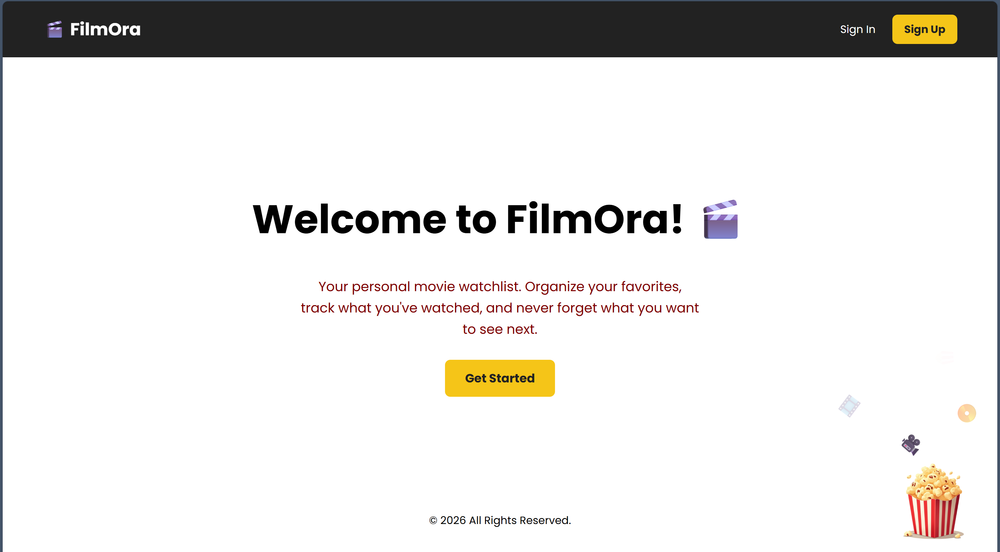
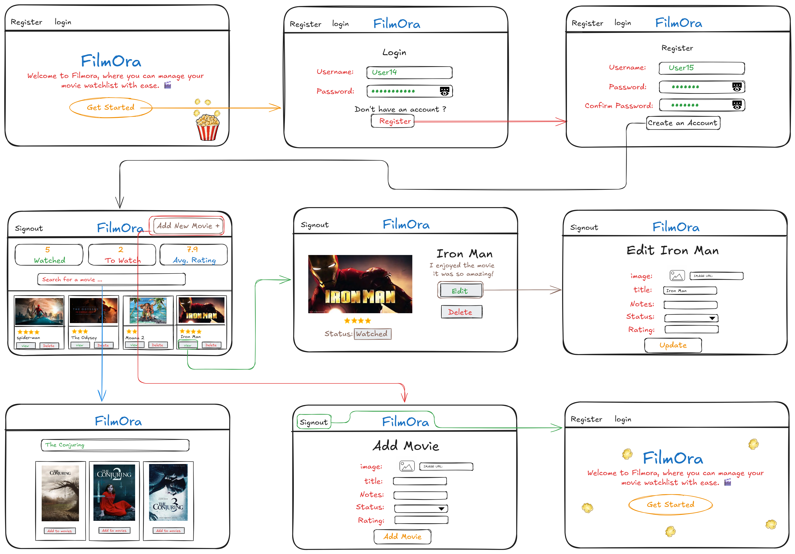
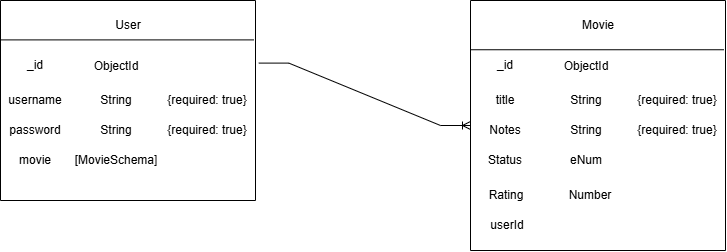

# FilmOra 🎞️

FilmOra is a full-stack movie watchlist application that allows users to search, organize, and manage their personal movie collections. The platform provides full CRUD functionality, enabling users to create, view, update, and delete movie entries while tracking ratings and viewing status.

## Key Features

- 🔐 User authentication
- 🔎 Movie search using the OMDb API
- ➕ Add movies to a personal collection
- ✏️ Edit movie information
- ⭐ Rate movies
- 🎬 Track movie status
- 🗑️ Delete movies
- 📊 View personal movie collection

## Screenshot of FilmOra

## Live Demo

🔗 [Visit FilmOra](https://filmora-tnxu.onrender.com/)

## User Stories

- As a user, I want to be able to create an account.
- As a user, I want to be able to log in to my account.
- As a user, I want to be able to log out of my account.
- As a user, I should be able to search for a movie and add it to my collection.
- As a user, I should be able to view my movie collection.
- As a user, I should be able to edit a movie's status, rating, and other information.
- As a user, I should be able to delete movies from my movie collection.
- As a user, I want to rate a movie so that I can record my opinion of it.
- As a user, I want to set the movie status to **Watched**, **To Watch**, or **Not Yet**.

## Wireframe

## ERD

## Attributions

- Movie information and posters: [OMDb API](https://www.omdbapi.com/)
- Font: [Poppins](https://fonts.google.com/specimen/Poppins) by Google Fonts

## Technologies Used

**Frontend:** HTML, CSS, JavaScript, EJS  
**Backend:** Node.js, Express.js  
**Database:** MongoDB, Mongoose  
**API:** OMDb API  
**Deployment:** Render  
**Version Control:** Git & GitHub

## Future Work

- Add user profile customization.
- Add movie search filters by genre, year, and rating.
- Add a favorites feature.
- Add movie recommendations based on the user's watchlist.
- Improve mobile responsiveness and overall UI.
- Add more detailed movie information, such as cast, genre, and plot.